<h1>System developer .NET student</h1>

30 year old .NET/C# fullstack student. Here to log my progress, collab with others of likeminded drive and ambition, and to grow as both a developer and creator

  <picture>
    <source media="(prefers-color-scheme: dark)" srcset="./profile/stats-dark.svg">
    <source media="(prefers-color-scheme: light)" srcset="./profile/stats-light.svg">
    
  </picture>

  <picture>
    <source media="(prefers-color-scheme: dark)" srcset="./profile/top-langs-dark.svg">
    <source media="(prefers-color-scheme: light)" srcset="./profile/top-langs-light.svg">
    
  </picture>

  
<h2>Some quick info about me</h2>

- 🔭 Currently co-heading a hobby project named Munilytics with some of my dearest friends, check out the repo!

- 🌱 Right now I am mostly focused on learning ASP.NET and building data intensive applications orchestrated with Aspire

- 👯 I’m looking to collaborate on anything that is exciting, with anyone that is excited about it!

- 🐉 Pronouns: She/Her (nothing else is acceptable. I am a human being that deserves basic respect)

- 📫 Reach me <a target="_blank" href="https://www.linkedin.com/in/elviramariesdotter/">here</a>

<h2>Looking forward to work with ya!</h2>
<h3><em>// Vira, aka Sunberry</em></h3>
